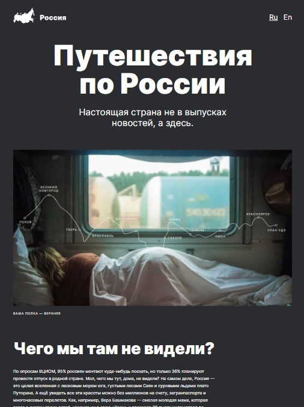

# sprint-4-adaptive-css

Version 1.0.0

## About project:
Demo project for getting aquainted with adaptive and responsive design basics. The page is developed in compliance with Figma design layout for 6 screen dimensions.

## Main functionality: 
- This is a one-page static website with numerous pictures and articles devoted to motivating users to travel across Russia.

## Stack:
CSS3 (flex-box, grid-layout), HTML5, BEM, DevTools, PerfectPixel

## How to launch:
- Go to https://ustyuzhanina.github.io/sprint-4-adaptive-css
- Enjoy reading (if you know Russian). If not, then just make sure, that the author is now familiar with the concept of adaptive and responsive design.